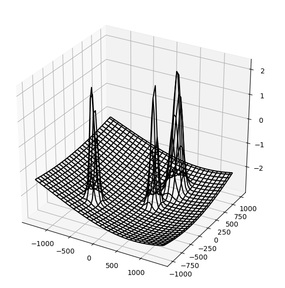
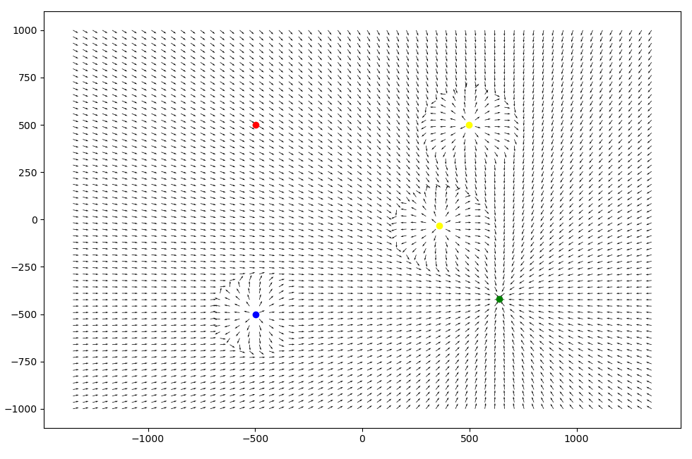
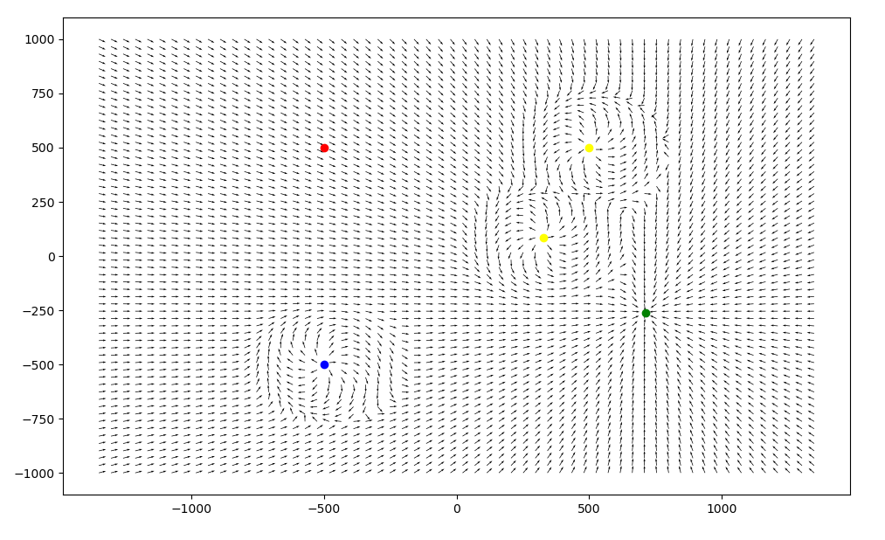
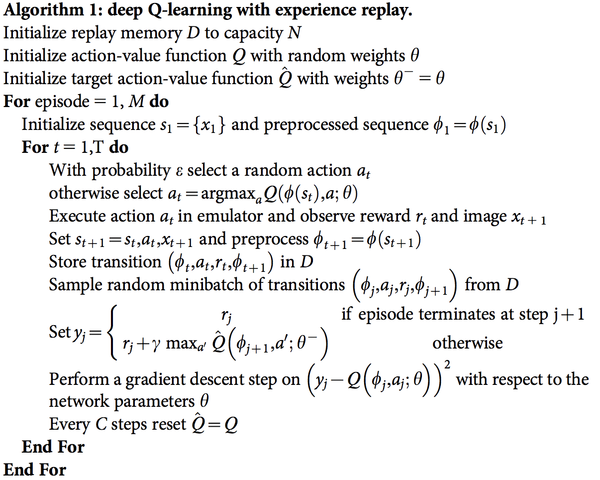
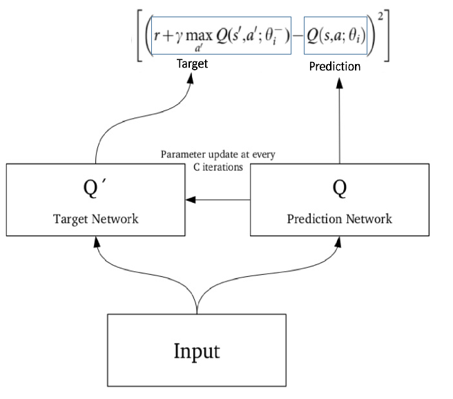
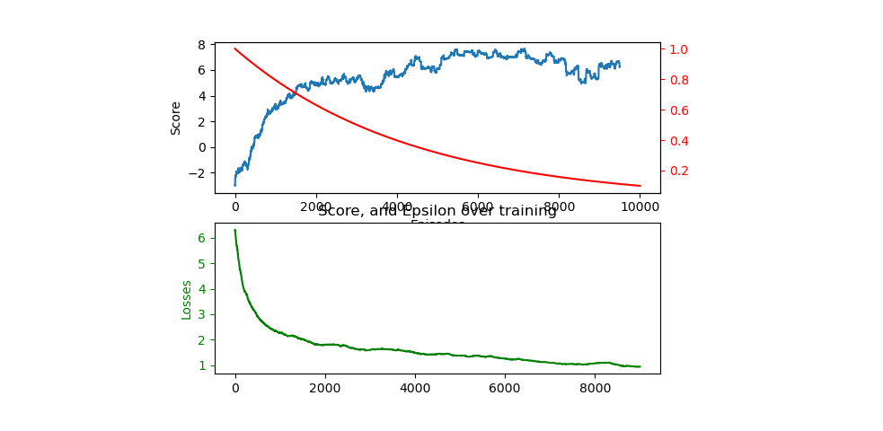
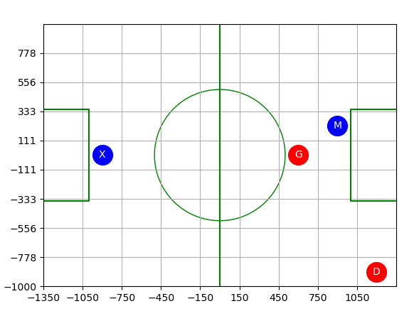
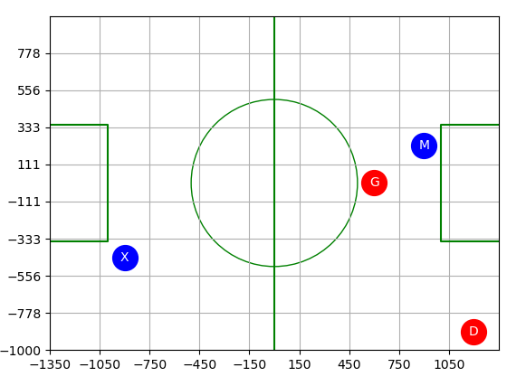
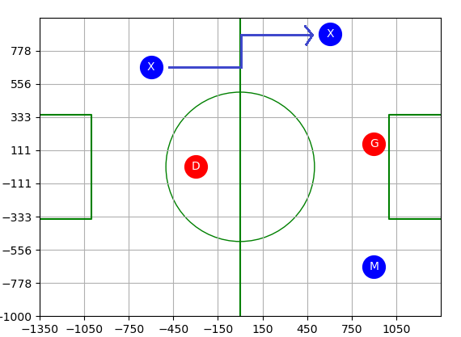

# FC Furious
 
## Partie Coach

### Création d'un champ pour aller à l'objectif en évitant les autres robots :
L'idée de base est de créer un champ répulsif en faisant le gradient de la somme des potentiels, avec un potentiel positif pour les robots à éviter et un potentiel négatif pour l'objectif. Le potentiel étant calculé avec une loi normale :  
On peut observer les potentiels :  
  
On obtient un champ de cette forme :
  
On voit que le champ répulsif ne permet que d'éviter le robot mais pas de le contourner, de plus il y a des changements brusques de directions.  

On a alors créé un mix d'un champ tournant (rotation de +/-90° du champ répulsif en fonction de la position du robot répulsif) et du champ répulsif Erobot=Etournant+k*Erépulsif avec k=facteur de répulsion.  
De plus, on prend sigma du potentiel pour le champ tournant plus grand donc son effet apparait en premier.  
Ainsi, on obtient :  
  

Ainsi, pour la commande du robot on utilise la direction du vecteur à la position du robot.

--------------
## Partie intelligence artificielle

### Objectif :
Le but de cette intelligence artificielle est de déplacer un attaquant vers un endroit où le but est ouvert en un minimum de déplacements.

------------
### Agent :
Dans ce cas, on traité un réseau de neurone profond, c'est à dire avec plusieurs couches. On peut le representer sous cette forme :

* En entrée, on rentre un état représentatif de la position des robots sous la forme d'un vecteur de dimension 4x9x9.  
* En sortie, on obtient une prédiction pour chacune des actions qui est proportionnelle à la récompense qu'on peut espérer à long terme. On choisit donc l'action pour laquelle l'espérance est la plus grande.  

---
### Entrainement :
Voici l'algorithme général d'apprentissage dans le cas du deep Q learning :

  

Il peut être simplifié sous la forme suivante :  

  

Tout d'abord, il a fallu coder une Classe pour représenter l'environnement dans lequel l'agent va évoluer.  
* Les actions possibles : HAUT, BAS, DROITE, GAUCHE
* Le terrain avec ses limites
* L'objectif pour finir une partie : but ouvert
* Les récompenses :   
  * -1 par déplacement effectué pour forcer l'agent à trouver le plus court chemin
  * -3 s'il sort du terrain ou s'il se prend un autre robot (la valeur étant plus élévé, l'agent devrait éviter les robots plus facilement)
  * +10 si l'objectif est accompli  
  
Ensuite, il a fallu coder une Classe pour l'agent avec :
* Les deux réseaux de neurone Q et Q' (noté q_network et target_network dans le code)
* Une fonction qui choisit la meilleure action
* Les fonctions nécéssaires pour entrainer l'agent

Après de nombreux tests, modifications du programme d'entrainement etc.. Voici les résultats du meilleur entrainement (pour 10000 parties jouées) :

On observe effectivement que la fonction Loss function *[(r+&gamma;max Q'a'(s',a';&theta;i)) - Q(s,a;&theta;i]²* diminue bien sur le graphique du bas.  
De plus, le score des parties augmentent jusqu'à atteindre quasiment 8, cela correspond à atteindre l'objectif en 3 mouvements seulement. C'est très bon, l'algorithme d'entrainement est éfficace et on a obtenu un bon agent.

Exemple de génération de partie :  

* X représentant l'attaquant qui veut marquer, c'est lui qui est controlé par notre agent.
* M représentant son coéquipier.
* G représentant le gardien
* D représentatn le 2ème defenseur.

Sur cette situation, on obtient au final cette position pour l'attaquant :
  
* Mouvements : 2  
* Score : 9

De même, on obtient ce résultat :  
  
* Mouvements : 5  
* Score : 6  

La génération étant aléatoire pour couvrir toutes les configurations de terrains possibles, parfois l'issue est très simple (1 mouvement suffit), d'autres fois elle l'est beaucoup moins.  

---
### Validation de l'agent obtenu :
Après plusieurs séries de tests sur 10000 générations de parties aléatoires. Le score moyen est de 8.6 avec un taux d'échec inférieur à 0.6%. Un échec est comptabilisé si l'agent n'atteint pas l'objectif en moins de 20 coups.  
Les résultats sont très satisfaisants et donc utilisables pour le coach.   
De plus le temps d'execution de 10000 parties est seulement d'une cinquantaine de seconde donc assez rapide pour être implémenté.

---
### Implémentation dans le code du coach :
Cette ia intervient lorsque un des attaquants n'a pas le but libre devant lui. Dans ce cas, on fait appel à cette ia qui calcule la position finale et le score pour s'ouvrir le chemin du but. Ainsi, on peut commander le robot vers cette position.  
La limite de cette ia c'est qu'elle ne prend pas en compte les déplacements des joueurs et donc la solution ne menera pas toujours à un but.  
On verra par la suite comment l'utiliser :
* Prédiction de la position finale
* Prédiction des déplacements un par un pour ainsi actualiser l'état du terrain entre deux déplacements.
